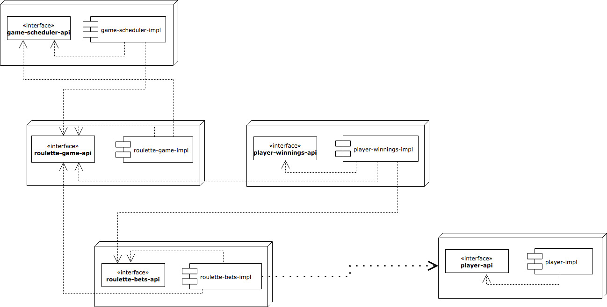

[](https://travis-ci.org/andrei-l/reactive-roulette)

# reactive-roulette

Reactive Roulette application with Lagom framework. 


## Architecture 



## Project details


### API

All interaction with application should be performed against Service Gateway which is running at http://localhost:9000.
So far next API is supported:  

| Method | Path                                          | Service which will be called         |
|--------|-----------------------------------------------|--------------------------------------|
| POST   | /api/roulette-game-bet/:gameId/bet            | roulette-bets (http://0.0.0.0:62315) |
| POST   | /api/player                                   | player        (http://0.0.0.0:52620) |
| POST   | /api/player/login                             | player        (http://0.0.0.0:52620) |
| GET    | /api/player/:playerId                         | player        (http://0.0.0.0:52620) |
| POST   | /api/recurring-game                           | game          http://0.0.0.0:52620)  |
| GET    | /api/recurring-game/:gameId                   | game          http://0.0.0.0:52620)  |

### Running 

In order to run the project use `sbt runAll`

### Load / Functional testing

There is a special micro-service called `load-test` which tries to load application in a following way:
 - it registers users
 - it creates games
 - it asks users to places bets on the games
 - it awaits for results
 
Communication with `load-test` module happens via WebSocket. 
For conveniece there is a [sample html page](load-test-impl/src/main/resources/websocket-loadtest.html) which encapsulates websocket channel. 

It accepts request in a following format: 

```
    {
      "numberOfConcurrentGames": 1,
      "numberOfPlayers": 1,
      "numberOfBetsToPlace": 1
    }

```
